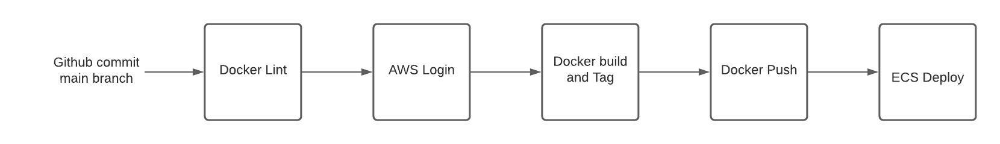
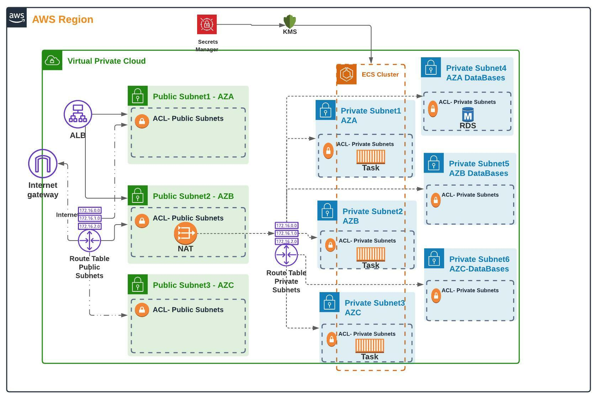

# Ghost NordCloud assesment
by Daniel Rivera

## General Information

This project deploy an AWS infrastructure to support Ghost CMS, the project has been divided into two folders, the infrastructure folder contains the terraform code to create the AWS resources to support Ghost. The lambda folder contains a simple python code that delete all the post created in ghost and the root folder contains the Dockerfile used to build the image to run in AWS ECS.

The Infrastructure folder contains the terraform code to deploy AWS resources, a modules folder has been created to store the Terraform modules used in this project,third party modules were used as well. Terraform state is storing locally but feel free to use external tools like S3 bucket or Terraform Cloud.
The resources created by scripts are:

- AWS Networking resources, following best practices for HA
- ECS Cluster
- ECS Service
- RDS instance
- Application Load Balancer(Public) 
- Secret Manager to store env variables necessary for the application
- IAM Roles for ECS Tasks, CodePipeline, and CodeBuild
- Security Groups
- KMS key to encrypt Secret Manager

## General Steps

There are general steps that you must follow to launch the resources.

Before launching a resource you need to have in mind  the following:

  - Install terraform, use Terraform v1.0.9, you can download it here 
     https://releases.hashicorp.com/terraform/1.0.9/
  - Configure the AWS credentials into your laptop(for Linux  ~/.aws/credentials), you need to use the following format:

            [PROFILE_NAME]
            aws_access_key_id = Replace_for_correct_Access_Key
            aws_secret_access_key = Replace_for_correct_Secret_Key

       If you have more AWS profiles feel free to add them.
  - Docker, you can check the documentation here
    https://docs.docker.com/engine/install/


## Usage

**1.** Clone the repository

**2.** There is a file named deploy.sh this file will run terraform apply command and push the first image to ECR repository.This script requieres some variables that you must specify in the following order:
```bash
sh deploy.sh   AWS_REGION   ENVIRONMENT_NAME_TO_CREATE    AWS_PROFILE_NAME

```
- **AWS_REGION:** It is the region where the infrastructure will be deployed
- **ENVIRONMENT_NAME_TO_CREATE:** It is the rname to assing to some resources, some tags are added according with this value
- **AWS_PROFILE_NAME:** The AWS profile name created in ~/.aws/credentials

 
The execution of the script can take 10 minutes approximately. When this finishes you can check the output and validate that terraform print the ALB DNS, you can user this to access to Ghost site. 

**NOTE:** Terraform code will deploy a Ghost site from scratch, you need to create an account or upload a backup to RDS instance

**3.** Once terraform has deployed the infrastructure and the image was pushed you can access to the site through the ALB DNS that terraform print in the console, with this you can access to the admin URL adding /ghost, that will show a console to create a user.
 
                               http://alb-example.us-east-1.elb.amazonaws.com/ghost

 **NOTE:** Reeplace the ALB url with the output generate by terraform 

**4.** Once you have created the account you should create a custom integration that will generate an API Key, to create that you can access to the url:

                       http://alb-example.us-east-1.elb.amazonaws.com/ghost/#/settings/integrations

wWen you create the custom integration Ghost will show you the Admin API KEY, you need to add that key in AWS secret manager

**5.** Move to AWS console and search the AWS secret manager service, there you should have the secret manager created by terraform, the name contains the value of the variable that you specified in the step 2. Select the secret and hit the option that says "get secret values", there you will see the environment variables used by ECS, search for the variable named **ghost_api_key** and replace the value with the Admin API Key that you get in the step 4.

with those steps you have ready the Ghost environment and you can start to create post :) 

## CI/CD

CI/CD has been configured using Github Action, in this repository in the folder .github you will found the YAML file that define the pipeline that is used to build the docker image and deploy in AWS ECS cluster.
the following image show the procces that the pipeline does



Each commit to main branch will trigger the pipeline. 
#### Stages

- **Docker Lint:** Validates the sintax of the Dockerfile, to do this a tool named [hadolint](https://github.com/hadolint/hadolint)
  is used.

- **AWS Login:**  Uses GitHub secret to store Access key and Secret key that then uses to login in AWS ECR

- **Docker build and tag:** Stars building the docker image and then push it to AWS ECR Repo 

- **ECS deploy:** once the docker image was pushed [ecs deploy](https://pypi.org/project/ecs-deploy/) tool will updates the task definition and update the ecs service with new task.


## Remove all the posts 

To delete all the post created in Ghost, a lambda function is created by terraform, to run it you can move to AWS Lambda service and execute the funcion. The function needs the Admin API Token to access to the Ghost site.


## Remove infrastructure resources

Run the following command if you want to delete the resources created.

```terraform
terraform destroy 
```

## Architecture 



### Networking

This architecture divides the AWS VPC into two groups of subnets.

- **Public Subnets**
   
   This subnet stores the AWS resources that need direct access to the internet. Components that are placed here could have a public IP address allowing that resources out of AWS can reach them.


- **Private Subnets:**
   
   Privates subnets store AWS resources that don’t need direct access from the internet, resources placed in these subnets won’t be able to assign public IP. 

Each subnet is associated with one AWS Availability Zone(AZ), and AWS services should be distributed in 2 subnets or AZ as a minimum.

#### IP Addressing

IP addressing is an important point when the AWS VPC is created, selecting the right IP addressing will affect directly the application scaling and security. Having a good track of the origin and destination of the request is an important segment and defining good CIDR block to VPC and Subnets, well-defined CIDR will help track issues or packages in our network.


#### CIDR for VPCs 

Following a multi-environment architecture, a specific CIDR will be defined for each environment, helping to maintain a well-defined IP address and track the packages' origin and destination. 

VPCs will use the 10.0.0.0/16 block, where the second octet will be the one to change and assign to VPCs.

```bash
10.X.0.0/16
   |----------> Block that can change 
                allowing to have 255 AWS VPCs
                10.0.0.0/16 to 10.255.0.0/16
```

#### CIDR for Subnets
To define the different blocks of subnets to use in each VPC the best practices recommends dividing the addresses space across the number of AZs to implement in the architecture, in this case, 4 AZ, three of them will be used to place resources and the last one will be optional for future uses. In each AZ private and public subnets will be created.

With 4 AZs, two bits are enough to represent the corresponding CIDR blocks, in this case, the following CIDRs will be used per AZ having /18 as a subnet mask

```bash
Availability Zone A -------> 10.X.0.0/18

Availability Zone B -------> 10.X.64.0/18

Availability Zone C -------> 10.X.128.0/18

Availability Zone D(Optional) -------> 10.X.192.0/18

```

To isolate the data plane, one subnet will be created in each AZ and another for other resources like EKS nodes, ec2 instances, or other services not related to the data plane. For those purposes, 2 subnets should be required per AZ, and to add flexibility additional subnets will be created for future requests.

According to the mentioned above 3 bits are enough to represent the 8 subnets in each AZ. with a /22 each subnet can allocate 1024 IP addresses. 2 bits can be used to represent the subnets for each AZ but that forces to have 2 free subnets to future request putting limits to segment new services.

```bash
Availability Zone A -------> 10.X.0.0/18
            Private Subnets
                |----------------> Subnet1     10.X.0.0/22
                |----------------> Subnet2_DB  10.X.4.0/22
                |----------------> Subnet3     10.X.8.0/22 (optional)
                |----------------> Subnet4     10.X.12.0/22 (optional)
                |----------------> Subnet5     10.X.16.0/22 (optional)
                |----------------> Subnet6     10.X.20.0/22 (optional)
                |----------------> Subnet7     10.X.24.0/22 (optional)
                |----------------> Subnet8     10.X.28.0/22 (optional)        

            Public Subnets
                |----------------> Subnet1     10.X.32.0/22
                |----------------> Subnet2     10.X.36.0/22 (optional)
                |----------------> Subnet3     10.X.40.0/22 (optional)
                |----------------> Subnet4     10.X.44.0/22 (optional)
                |----------------> Subnet5     10.X.48.0/22 (optional)
                |----------------> Subnet6     10.X.52.0/22 (optional)
                |----------------> Subnet7     10.X.56.0/22 (optional)
                |----------------> Subnet8     10.X.60.0/22 (optional)
                
Availability Zone B -------> 10.X.64.0/18
            Private Subnets
                |----------------> Subnet1     10.X.64.0/22
                |----------------> Subnet2_DB  10.X.68.0/22
                |----------------> Subnet3     10.X.72.0/22 (optional)
                |----------------> Subnet4     10.X.76.0/22 (optional)
                |----------------> Subnet5     10.X.80.0/22 (optional)
                |----------------> Subnet6     10.X.84.0/22 (optional)
                |----------------> Subnet7     10.X.88.0/22 (optional)
                |----------------> Subnet8     10.X.92.0/22 (optional)
    
            Public Subnets
                |----------------> Subnet1     10.X.96.0/22
                |----------------> Subnet2     10.X.100.0/22 (optional)
                |----------------> Subnet3     10.X.104.0/22 (optional)
                |----------------> Subnet4     10.X.108.0/22 (optional)
                |----------------> Subnet5     10.X.112.0/22 (optional)
                |----------------> Subnet6     10.X.116.0/22 (optional)
                |----------------> Subnet7     10.X.120.0/22 (optional)
                |----------------> Subnet8     10.X.124.0/22 (optional)

Availability Zone C -------> 10.X.128.0/18
            Private Subnets
                |----------------> Subnet1     10.X.128.0/22
                |----------------> Subnet2_DB  10.X.132.0/22
                |----------------> Subnet3     10.X.136.0/22 (optional)
                |----------------> Subnet4     10.X.140.0/22 (optional)
                |----------------> Subnet5     10.X.144.0/22 (optional)
                |----------------> Subnet6     10.X.148.0/22 (optional)
                |----------------> Subnet7     10.X.152.0/22 (optional)
                |----------------> Subnet8     10.X.156.0/22 (optional)
    
            Public Subnets
                |----------------> Subnet1     10.X.160.0/22
                |----------------> Subnet2     10.X.164.0/22 (optional)
                |----------------> Subnet3     10.X.168.0/22 (optional)
                |----------------> Subnet4     10.X.172.0/22 (optional)
                |----------------> Subnet5     10.X.176.0/22 (optional)
                |----------------> Subnet6     10.X.180.0/22 (optional)
                |----------------> Subnet7     10.X.184.0/22 (optional)
                |----------------> Subnet8     10.X.188.0/22 (optional)

Availability Zone D(Optional) -------> 10.X.192.0/18

```

### ECS
AWS ECS service is used to run the docker images built for Ghost, and ECS service has been created with an Application Load Balancer that exposes the site to internet.
To support High Availability the ecs tasks created in differenes private subnets and the ALB distributes the traffic.

### Secrets

AWS secret manager is used to store environment variables that are sensitive like DB passwords or tokens.
Secret manager has a direct integrations with AWS ECS and can inyect the secret as an environment variable inside the container, the name of the variable is defined in the AWS ECS Task Definition.For instance if you have the following values in your secret manager.

```json
{
  "database__client": "mysql",
  "database__connection__database": "ghostdb"
```

and you specify in the task definition that the variable name is SECRETS, you can go inside the container and print the env varaibles and you will see the json as a value of the variable. According with this to extract each variable from the json and external process is required, in this case a bash script was created for that and is executed when the container starts.

```bash
imit="$(echo $secrets | jq length)"
x=0
while [ $x -ne $limit ]
do
  variable_name="$(echo $secrets | jq '. | keys' | jq ".[$x]" | sed -e "s/\"//g")"
  variable_value="$(echo $secrets | jq ".$variable_name" | sed -e "s/\"//g")"
  export "$variable_name"="$variable_value"
  x=$(( $x + 1 ))
done

echo "variables from secret manager done"
```

The secrets are encrypted at rest using a KMS key created.


